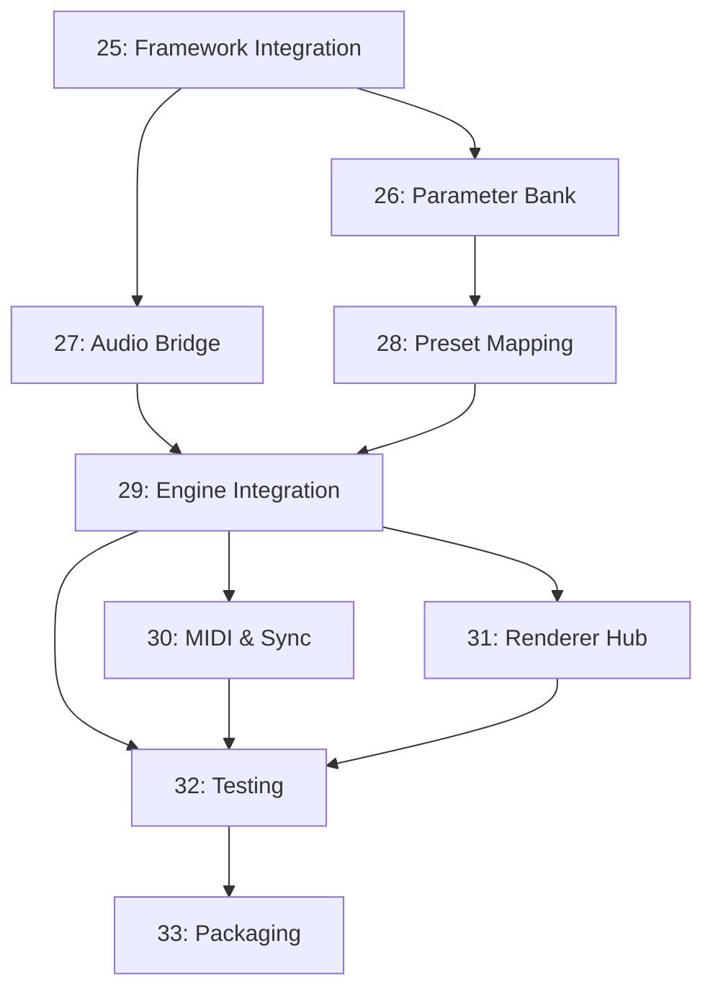

# VST Plugin Build Target - Task Overview

This directory contains task specifications for implementing a **VST3 plugin build target** for the vis_avs project. The plugin enables AVS visualizations to run inside DAWs (Digital Audio Workstations) as audio effects, with full DAW automation, MIDI control, and multi-instance support.

## Vision

Transform AVS from a standalone visualizer into a professional VST3 plugin that:
- Runs inside any VST3-compatible DAW (Reaper, Ableton, Bitwig, FL Studio, etc.)
- Responds to DAW automation and MIDI controllers
- Supports multiple simultaneous instances (multi-track visualization)
- Maintains zero audio latency (passthrough mode)
- Provides optional multi-screen output via Renderer Hub

## Architecture Overview

```
┌─────────────────────────────────────────────────────────────┐
│                        DAW Host                              │
│  ┌───────────────────────────────────────────────────────┐  │
│  │              AVS VST3 Plugin Instance                  │  │
│  │                                                         │  │
│  │  Audio Thread          Render Thread       UI Thread   │  │
│  │  ┌──────────┐         ┌──────────┐        ┌────────┐  │  │
│  │  │ Process  │────────>│  Engine  │───────>│ Editor │  │  │
│  │  │  Block   │ Features│          │ Frames │        │  │  │
│  │  │  (FFT,   │ (lock-  │  AVS     │ (GL    │  GL    │  │  │
│  │  │  Beat)   │  free)  │  Core    │  FBO)  │ Canvas │  │  │
│  │  └──────────┘         └──────────┘        └────────┘  │  │
│  │       ↑                     ↑                          │  │
│  │  ┌────┴─────┐         ┌─────┴──────┐                  │  │
│  │  │ MIDI CC  │         │ Parameter  │                  │  │
│  │  │  Learn   │         │   Bank     │<─ DAW Automation │  │
│  │  └──────────┘         │ (56 params)│                  │  │
│  │                       └────────────┘                  │  │
│  └───────────────────────────────────────────────────────┘  │
└─────────────────────────────────────────────────────────────┘
           │                            │
           │ (Optional IPC)             │
           ↓                            ↓
    ┌─────────────────────────────────────────┐
    │       Renderer Hub (Multi-Screen)       │
    │  ┌──────────┐  ┌──────────┐            │
    │  │Projector1│  │Projector2│  (external) │
    │  └──────────┘  └──────────┘            │
    └─────────────────────────────────────────┘
```

## Core Concepts

### Stable Parameter Bank
Instead of exposing preset-specific parameters (which would break DAW automation on preset change), we expose a **fixed set of 56 parameters**:
- 32 Macros (continuous 0..1)
- 8 Buttons (momentary/toggle)
- 2 XY Pads (4 axes total)
- 8 Scene triggers
- 1 Crossfader
- 2 Preset navigation buttons

These parameters **never change** - only their *mapping* to engine controls changes per preset.

### Preset Control Mapping
Each preset includes metadata that maps stable parameters to engine controls:
```json
{
  "preset": {
    "controls": {
      "slots": [
        {
          "control": "macro.1",
          "target": "effect.superscope.n_points",
          "range": {"min": 100, "max": 4000},
          "curve": "log"
        }
      ]
    }
  }
}
```

When you switch presets, Macro 1's VST parameter ID stays the same, but it now controls a different engine parameter. DAW automation continues to work seamlessly.

## Task Dependencies



**Critical path**: 25 → 26 → 28 → 29 → 32 → 33

**Parallel tracks**:
- Audio: 25 → 27 → 29
- MIDI: 30 (after 29)
- Advanced: 31 (optional, parallel to others)

## Task Breakdown

| Task | Title | Status | Priority | Estimated Effort |
|------|-------|--------|----------|------------------|
| **25** | Framework Integration | TODO | Critical | 2-3 days |
| **26** | Stable Parameter Bank | TODO | Critical | 3-4 days |
| **27** | Audio Feature Bridge | TODO | Critical | 2-3 days |
| **28** | Preset Control Mapping | TODO | Critical | 3-4 days |
| **29** | Engine Integration | TODO | Critical | 4-5 days |
| **30** | MIDI & Host Sync | TODO | High | 2-3 days |
| **31** | Renderer Hub IPC | TODO | Low (optional) | 5-7 days |
| **32** | Testing & Validation | TODO | Critical | 3-4 days |
| **33** | Packaging & Distribution | TODO | High | 2-3 days |

**Total estimated effort**: 26-36 days (excluding optional Renderer Hub: 21-29 days)

## Technical Decisions Summary

### Framework: JUCE 7
- **Why**: Industry standard, excellent VST3/CLAP support, OpenGL/Vulkan integration, MIT license
- **Alternatives considered**: iPlug2 (lighter but less mature), VST3 SDK (too low-level)

### Threading Model
1. **Audio thread** (high priority, real-time): Feature extraction → lock-free queue
2. **Render thread** (medium priority, 60 FPS): Engine update + OpenGL rendering
3. **UI thread** (low priority): Display frames, handle mouse/keyboard

### Audio Path
- **Mode**: Zero-latency stereo passthrough (2in/2out) + optional sidechain (2in)
- **Features**: Lock-free ring buffer (SPSC queue), ~2 seconds capacity
- **Latency**: 0 samples reported to host

### Parameters
- **Count**: 56 stable parameters (fixed across all presets)
- **Automation**: Fully automatable via DAW or MIDI CC
- **Smoothing**: 30-40ms exponential smoothing to prevent zipper noise

### Preset Format
- **Extension**: Add `controls` section to existing JSON preset schema
- **Backward compatibility**: Legacy presets get default mappings
- **Mapping**: Runtime lookup table (ParamID → EngineTarget)

## Development Workflow

### Phase 1: Foundation (Tasks 25-27)
Build the plugin skeleton with audio passthrough and parameter infrastructure.
**Goal**: Plugin loads in DAW, passes audio, exposes parameters.

### Phase 2: Integration (Tasks 28-29)
Wire AVS engine to plugin, implement preset loading with control mapping.
**Goal**: Plugin renders AVS visualizations, responds to automation.

### Phase 3: Polish (Tasks 30-32)
Add MIDI, host sync, comprehensive testing, DAW compatibility.
**Goal**: Production-ready plugin that passes pluginval and works in major DAWs.

### Phase 4: Release (Task 33)
Package, code sign, create installers for Windows/macOS/Linux.
**Goal**: Distributable plugin ready for public release.

## Testing Strategy

### Unit Tests (ctest)
- Parameter bank (smoothing, serialization, thread safety)
- Audio feature bridge (ring buffer, feature extraction)
- Preset control mapping (curve evaluation, range mapping)
- MIDI CC mapping
- Transport sync

### Integration Tests
- Load preset → verify visualization matches preset spec
- DAW automation → verify parameter changes reach engine
- MIDI CC learn → verify controller mapping works
- State save/restore → verify session persistence

### Validation
- **pluginval** (strict mode): VST3 spec compliance, threading, crashes, leaks
- **DAW testing**: Manual QA in Reaper, Bitwig, Ableton, FL Studio

### Performance
- **CPU**: <5% per instance (Intel i5 @ 512 samples/48kHz)
- **GPU**: <10% for typical preset (integrated GPU, 1080p/60fps)
- **Latency**: 0 samples
- **Frame rate**: 60 FPS stable

## Resource Requirements

### Hardware
- Linux development: Ubuntu 22.04+ (primary), NVIDIA or AMD GPU
- macOS testing: macOS 11+ (for code signing/notarization)
- Windows testing: Windows 10/11 (for installer testing)

### Software
- CMake 3.22+
- JUCE 7.0.12+
- C++17 compiler (GCC 11+, Clang 14+, MSVC 2019+)
- OpenGL 3.3+ or Vulkan 1.1+
- pluginval (for validation)

### Accounts (for release)
- Apple Developer Program ($99/year) - for macOS code signing
- Windows code signing certificate ($100-400/year) - for Windows installer

## Future Enhancements (Post-MVP)

- **CLAP format support** (alternative to VST3, open-source)
- **VST2 support** (legacy, but still widely used)
- **AU support** (macOS Audio Units, for Logic Pro)
- **AAX support** (Avid Pro Tools, requires PACE iLok)
- **Renderer Hub** multi-instance mixing modes
- **MIDI note → scene mapping** (drum pads for scene triggers)
- **OSC support** (control from TouchOSC, Lemur, etc.)
- **Syphon/Spout** output (video streaming to VJ software)
- **NDI output** (network video for broadcast)

## Success Metrics

A successful VST plugin implementation will:
1. ✅ Load in at least 3 major DAWs without crashes
2. ✅ Pass pluginval strict mode (0 errors)
3. ✅ Support DAW automation with smooth parameter changes
4. ✅ Achieve <5% CPU usage per instance
5. ✅ Maintain 60 FPS rendering
6. ✅ Handle 8+ simultaneous instances
7. ✅ Persist state correctly across DAW sessions
8. ✅ Support MIDI CC learn for hardware controllers

## Getting Started

To begin implementation:

1. **Read all task files** in order (25 → 33)
2. **Start with Task 25** (Framework Integration) - this is the foundation
3. **Follow dependencies** - don't skip ahead without completing prerequisites
4. **Test incrementally** - validate each task before moving to next
5. **Document decisions** - update task files with implementation notes

## Questions & Discussion

For questions about the VST plugin architecture or task specifications:
- Check existing task files for detailed technical decisions
- Review JUCE documentation: https://juce.com/learn/documentation
- Reference VST3 SDK: https://steinbergmedia.github.io/vst3_dev_portal/

---

**Status**: Ready for implementation
**Last Updated**: 2025-11-19
**Maintainer**: Claude Code Assistant
